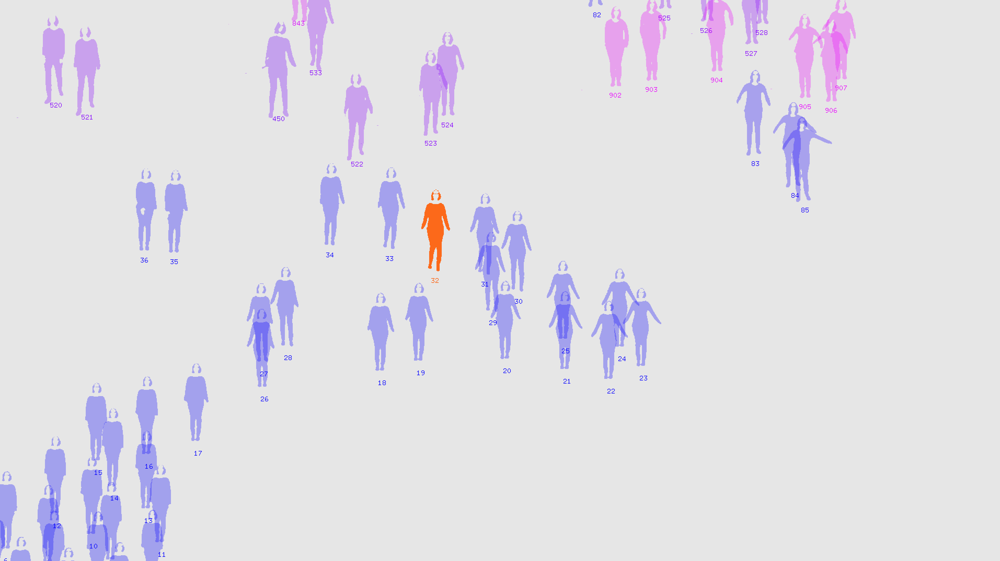
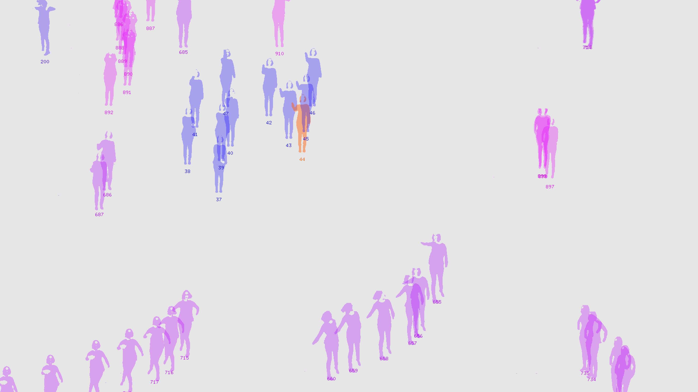
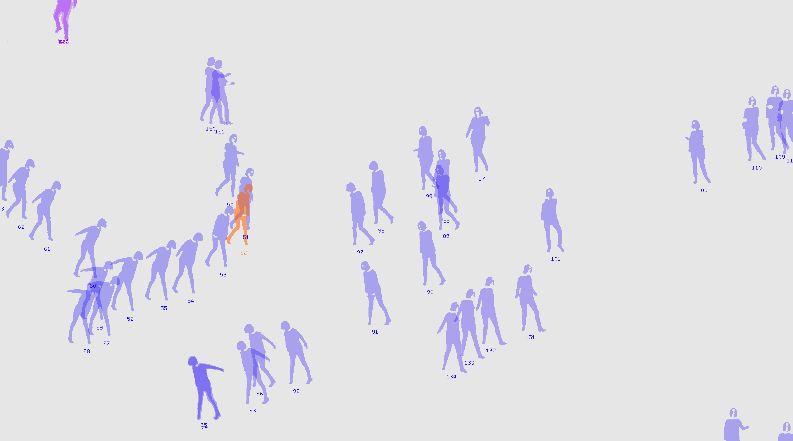

# Hacking-Coreography-Workshop
Kate Sicchio Workshop at Resonate 2017

a t-SNE (t-Distributed Stochastic Neighbor Embedding) Choreography navigator.

## Dependecies

OpenFrameworks 0.9.8
[ofxTSNE](https://github.com/genekogan/ofxTSNE)
[ofxCcv](https://github.com/kylemcdonald/ofxCcv)
[ofxCv](https://github.com/kylemcdonald/ofxCv)
ofxOpenCv
ofxGui

Authors: [Enrico Viola](https://github.com/naus3a/), [Roberto Fazio](https://github.com/robertofazio), [Jacopo Rosano](https://github.com/jacoporosano)

